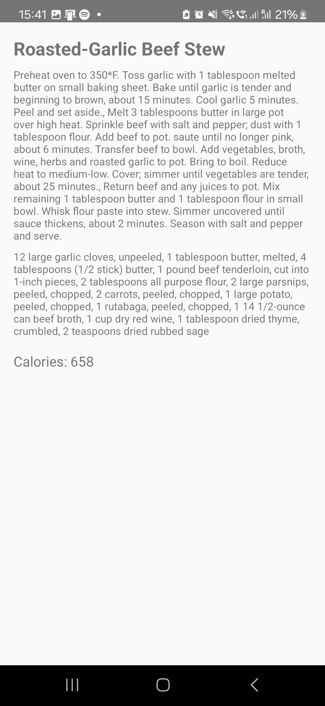

# Good_Food

https://github.com/user-attachments/assets/7ef5a237-a510-4568-9cc3-dd8105e896d8

## 🙌Inspiration

AS CS students, it has become a norm for us to not eat adequately, 
skipping meals, not geting enough nutrients and parents worrying about us is pretty common.

Thus, welcome to Good Food, an Android project which allows you to choose recipes within 3 categories; Protein, Vegetarian and Dessert

## 🔦Intro

I build this project using Android Studio as I didn't have much experience in Android development projects.
This project works by taking recipes of food from <a href="https://github.com/Moonshallow5/Good_Food/blob/main/app/src/main/assets/finalRecipes.json">json file</a>
 
and I categorized it into 3 different categories for users to choose from; "Protein", "Dessert" and "Vegetarian" foods.

## 🚧Challenges faced 

This was my first time building an app in Android Studio so obviously there was a huge learning curve in doing that
but the main challenges was learning how to use Android Studio, learning how to read the json file and split it into 3 different categories 

and (the hardest out of all) how to integrate Amazon Alexa to read the recipes aloud if user chooses to

## 😀End result

The program works as expected, the user will get a random recipe depending on the category that they picked, and a way to make the recipe. However, Alexa is not able to read the recipes in the json file as of yet but is only able to read recipes in <a href="https://github.com/Moonshallow5/Good_Food/blob/main/amzn1.ask.skill.185307f3-693e-47dc-bb91-52fc0b1675ee/lambda/index.js"> this file</a>.

Furthermore, when using Alexa, users must have the Alexa app installed on their phone and will be linked out of my program.

## 👀Future Implementations

- Get a larger dataset of recipes and ways to cook the recipe
- Improve UI, maybe add a video and pictures of the food across each step
- Have Alexa work to read the recipe as shown

